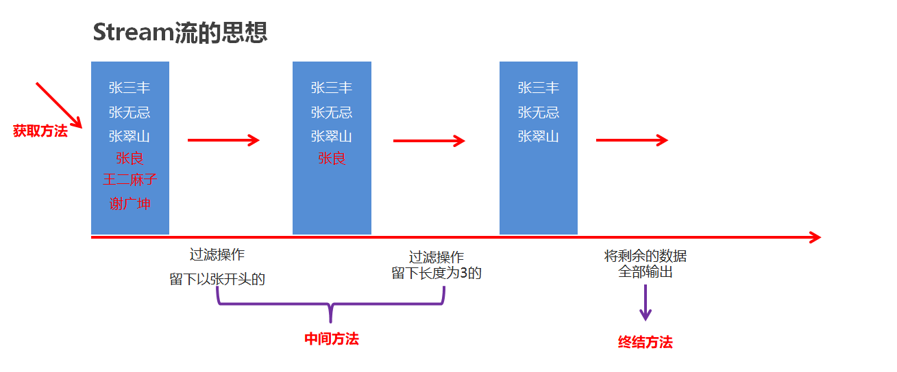

## 1. Stream
### 1.1 体验Stream流【理解】

- 案例需求

  按照下面的要求完成集合的创建和遍历

  - 创建一个集合，存储多个字符串元素
  - 把集合中所有以"张"开头的元素存储到一个新的集合
  - 把"张"开头的集合中的长度为3的元素存储到一个新的集合
  - 遍历上一步得到的集合

- 原始方式示例代码

  ```java
  public class MyStream1 {
      public static void main(String[] args) {
          //集合的批量添加
          ArrayList<String> list1 = new ArrayList<>(List.of("张三丰","张无忌","张翠山","王二麻子","张良","谢广坤"));
          //list.add()

          //遍历list1把以张开头的元素添加到list2中。
          ArrayList<String> list2 = new ArrayList<>();
          for (String s : list1) {
              if(s.startsWith("张")){
                  list2.add(s);
              }
          }
          //遍历list2集合，把其中长度为3的元素，再添加到list3中。
          ArrayList<String> list3 = new ArrayList<>();
          for (String s : list2) {
              if(s.length() == 3){
                  list3.add(s);
              }
          }
          for (String s : list3) {
              System.out.println(s);
          }      
      }
  }
  ```

- 使用Stream流示例代码

  ```java
  public class StreamDemo {
      public static void main(String[] args) {
          //集合的批量添加
          ArrayList<String> list1 = new ArrayList<>(List.of("张三丰","张无忌","张翠山","王二麻子","张良","谢广坤"));

          //Stream流
          list1.stream().filter(s->s.startsWith("张"))
                  .filter(s->s.length() == 3)
                  .forEach(s-> System.out.println(s));
      }
  }
  ```

- Stream流的好处

  - 直接阅读代码的字面意思即可完美展示无关逻辑方式的语义：获取流、过滤姓张、过滤长度为3、逐一打印
  - Stream流把真正的函数式编程风格引入到Java中
  - 代码简洁

### 1.2 Stream流的常见生成方式【应用】

- Stream流的思想

  

- Stream流的三类方法

  - 获取Stream流
    - 创建一条流水线,并把数据放到流水线上准备进行操作                                                                                                                                                       
  - 中间方法
    - 流水线上的操作
    - 一次操作完毕之后,还可以继续进行其他操作
  - 终结方法
    - 一个Stream流只能有一个终结方法
    - 是流水线上的最后一个操作

- 生成Stream流的方式

  - Collection体系集合

    使用默认方法stream()生成流， default Stream<E> stream()

  - Map体系集合

    把Map转成Set集合，间接的生成流

  - 数组

    通过Arrays中的静态方法stream生成流

  - 同种数据类型的多个数据

    通过Stream接口的静态方法of(T... values)生成流

- 代码演示

  ```java
  public class StreamDemo {
      public static void main(String[] args) {
          //Collection体系的集合可以使用默认方法stream()生成流
          List<String> list = new ArrayList<String>();
          Stream<String> listStream = list.stream();
  
          Set<String> set = new HashSet<String>();
          Stream<String> setStream = set.stream();
  
          //Map体系的集合间接的生成流
          Map<String,Integer> map = new HashMap<String, Integer>();
          Stream<String> keyStream = map.keySet().stream();
          Stream<Integer> valueStream = map.values().stream();
          Stream<Map.Entry<String, Integer>> entryStream = map.entrySet().stream();
  
          //数组可以通过Arrays中的静态方法stream生成流
          String[] strArray = {"hello","world","java"};
          Stream<String> strArrayStream = Arrays.stream(strArray);
        
        	//同种数据类型的多个数据可以通过Stream接口的静态方法of(T... values)生成流
          Stream<String> strArrayStream2 = Stream.of("hello", "world", "java");
          Stream<Integer> intStream = Stream.of(10, 20, 30);
      }
  }
  ```

### 1.3Stream流中间操作方法【应用】

- 概念

  中间操作的意思是,执行完此方法之后,Stream流依然可以继续执行其他操作

- 常见方法

  | 方法名                                      | 说明                                       |
  | ---------------------------------------- | ---------------------------------------- |
  | Stream<T> filter(Predicate predicate)    | 用于对流中的数据进行过滤                             |
  | Stream<T> limit(long maxSize)            | 返回此流中的元素组成的流，截取前指定参数个数的数据                |
  | Stream<T> skip(long n)                   | 跳过指定参数个数的数据，返回由该流的剩余元素组成的流               |
  | static <T> Stream<T> concat(Stream a, Stream b) | 合并a和b两个流为一个流                             |
  | Stream<T> distinct()                     | 返回由该流的不同元素（根据Object.equals(Object) ）组成的流 |

- filter代码演示

  ```java
  public class MyStream3 {
      public static void main(String[] args) {
  //        Stream<T> filter(Predicate predicate)：过滤
  //        Predicate接口中的方法	boolean test(T t)：对给定的参数进行判断，返回一个布尔值

          ArrayList<String> list = new ArrayList<>();
          list.add("张三丰");
          list.add("张无忌");
          list.add("张翠山");
          list.add("王二麻子");
          list.add("张良");
          list.add("谢广坤");

          //filter方法获取流中的 每一个数据.
          //而test方法中的s,就依次表示流中的每一个数据.
          //我们只要在test方法中对s进行判断就可以了.
          //如果判断的结果为true,则当前的数据留下
          //如果判断的结果为false,则当前数据就不要.
  //        list.stream().filter(
  //                new Predicate<String>() {
  //                    @Override
  //                    public boolean test(String s) {
  //                        boolean result = s.startsWith("张");
  //                        return result;
  //                    }
  //                }
  //        ).forEach(s-> System.out.println(s));

          //因为Predicate接口中只有一个抽象方法test
          //所以我们可以使用lambda表达式来简化
  //        list.stream().filter(
  //                (String s)->{
  //                    boolean result = s.startsWith("张");
  //                        return result;
  //                }
  //        ).forEach(s-> System.out.println(s));

          list.stream().filter(s ->s.startsWith("张")).forEach(s-> System.out.println(s));

      }
  }
  ```

- limit&skip代码演示

  ```java
  public class StreamDemo02 {
      public static void main(String[] args) {
          //创建一个集合，存储多个字符串元素
          ArrayList<String> list = new ArrayList<String>();

          list.add("林青霞");
          list.add("张曼玉");
          list.add("王祖贤");
          list.add("柳岩");
          list.add("张敏");
          list.add("张无忌");

          //需求1：取前3个数据在控制台输出
          list.stream().limit(3).forEach(s-> System.out.println(s));
          System.out.println("--------");

          //需求2：跳过3个元素，把剩下的元素在控制台输出
          list.stream().skip(3).forEach(s-> System.out.println(s));
          System.out.println("--------");

          //需求3：跳过2个元素，把剩下的元素中前2个在控制台输出
          list.stream().skip(2).limit(2).forEach(s-> System.out.println(s));
      }
  }
  ```

- concat&distinct代码演示

  ```java
  public class StreamDemo03 {
      public static void main(String[] args) {
          //创建一个集合，存储多个字符串元素
          ArrayList<String> list = new ArrayList<String>();
  
          list.add("林青霞");
          list.add("张曼玉");
          list.add("王祖贤");
          list.add("柳岩");
          list.add("张敏");
          list.add("张无忌");
  
          //需求1：取前4个数据组成一个流
          Stream<String> s1 = list.stream().limit(4);
  
          //需求2：跳过2个数据组成一个流
          Stream<String> s2 = list.stream().skip(2);
  
          //需求3：合并需求1和需求2得到的流，并把结果在控制台输出
  //        Stream.concat(s1,s2).forEach(s-> System.out.println(s));
  
          //需求4：合并需求1和需求2得到的流，并把结果在控制台输出，要求字符串元素不能重复
          Stream.concat(s1,s2).distinct().forEach(s-> System.out.println(s));
      }
  }
  ```

- map

```java
public class StreamDemo8 {
  public static void main(String[] args) {
         /*
            map                 转换流中的数据类型

            注意1：中间方法，返回新的Stream流，原来的Stream流只能使用一次，建议使用链式编程
            注意2：修改Stream流中的数据，不会影响原来集合或者数组中的数据
        */

    ArrayList<String> list = new ArrayList<>();
    Collections.addAll(list, "张无忌-15", "周芷若-14", "赵敏-13", "张强-20", "张三丰-100", "张翠山-40", "张良-35", "王二麻子-37", "谢广坤-41");
    //需求：只获取里面的年龄并进行打印
    //String->int

    //第一个类型：流中原本的数据类型
    //第二个类型：要转成之后的类型

    //apply的形参s：依次表示流里面的每一个数据
    //返回值：表示转换之后的数据

    //当map方法执行完毕之后，流上的数据就变成了整数
    //所以在下面forEach当中，s依次表示流里面的每一个数据，这个数据现在就是整数了
    list.stream().map(new Function<String, Integer>() {
      @Override
      public Integer apply(String s) {
        String[] arr = s.split("-");
        String ageString = arr[1];
        int age = Integer.parseInt(ageString);
        return age;
      }
    }).forEach(s-> System.out.println(s));

    System.out.println("------------------------");


    list.stream()
            .map(s-> Integer.parseInt(s.split("-")[1]))
            .forEach(s-> System.out.println(s));


  }
}
```

### 1.4Stream流终结操作方法【应用】

- 概念

  终结操作的意思是,执行完此方法之后,Stream流将不能再执行其他操作

- 常见方法

  | 方法名                           | 说明           |
  | ----------------------------- | ------------ |
  | void forEach(Consumer action) | 对此流的每个元素执行操作 |
  | long count()                  | 返回此流中的元素数    |

- 代码演示

  ```java
  public class MyStream5 {
      public static void main(String[] args) {
          ArrayList<String> list = new ArrayList<>();
          list.add("张三丰");
          list.add("张无忌");
          list.add("张翠山");
          list.add("王二麻子");
          list.add("张良");
          list.add("谢广坤");
  
          //method1(list);
          
  //        long count()：返回此流中的元素数
          long count = list.stream().count();
          System.out.println(count);
      }
  
      private static void method1(ArrayList<String> list) {
          //  void forEach(Consumer action)：对此流的每个元素执行操作
          //  Consumer接口中的方法void accept(T t)：对给定的参数执行此操作
          //在forEach方法的底层,会循环获取到流中的每一个数据.
          //并循环调用accept方法,并把每一个数据传递给accept方法
          //s就依次表示了流中的每一个数据.
          //所以,我们只要在accept方法中,写上处理的业务逻辑就可以了.
          list.stream().forEach(
                  new Consumer<String>() {
                      @Override
                      public void accept(String s) {
                          System.out.println(s);
                      }
                  }
          );
        
          System.out.println("====================");
          //lambda表达式的简化格式
          //是因为Consumer接口中,只有一个accept方法
          list.stream().forEach(
                  (String s)->{
                      System.out.println(s);
                  }
          );
          System.out.println("====================");
          //lambda表达式还是可以进一步简化的.
          list.stream().forEach(s->System.out.println(s));
      }
  }
  ```
  
```java
public class StreamDemo9 {
    public static void main(String[] args) {
       /*
            void forEach(Consumer action)           遍历
            long count()                            统计
            toArray()                               收集流中的数据，放到数组中
       */

        ArrayList<String> list = new ArrayList<>();
        Collections.addAll(list, "张无忌", "周芷若", "赵敏", "张强", "张三丰", "张翠山", "张良", "王二麻子", "谢广坤");


        //void forEach(Consumer action)           遍历

        //Consumer的泛型：表示流中数据的类型
        //accept方法的形参s：依次表示流里面的每一个数据
        //方法体：对每一个数据的处理操作（打印）
        list.stream().forEach(new Consumer<String>() {
            @Override
            public void accept(String s) {
                System.out.println(s);
            }
        });

        System.out.println("=========================");
        list.stream().forEach(s -> System.out.println(s));


        // long count()                            统计
        System.out.println("==========================================");
        long count = list.stream().count();
        System.out.println(count);


        // toArray()                               收集流中的数据，放到数组中
        System.out.println("==========================================");
        Object[] arr1 = list.stream().toArray();
        System.out.println(Arrays.toString(arr1));

        //IntFunction的泛型：具体类型的数组
        //apply的形参:流中数据的个数，要跟数组的长度保持一致
        //apply的返回值：具体类型的数组
        //方法体：就是创建数组


        //toArray方法的参数的作用：负责创建一个指定类型的数组
        //toArray方法的底层，会依次得到流里面的每一个数据，并把数据放到数组当中
        //toArray方法的返回值：是一个装着流里面所有数据的数组
        
       System.out.println("==========================================");
       String[] arr = list.stream().toArray(new IntFunction<String[]>() {
            @Override
            public String[] apply(int value) {
                return new String[value];
            }
        });

        System.out.println(Arrays.toString(arr));
        

        System.out.println("==========================================");

        String[] arr2 = list.stream().toArray(value -> new String[value]);
        System.out.println(Arrays.toString(arr2));

    }
}
```

### 1.5Stream流的收集操作【应用】

- 概念

  对数据使用Stream流的方式操作完毕后,可以把流中的数据收集到集合中

- 常用方法

  | 方法名                            | 说明        |
  | ------------------------------ | --------- |
  | R collect(Collector collector) | 把结果收集到集合中 |

- 工具类Collectors提供了具体的收集方式

  | 方法名                                                       | 说明                   |
  | ------------------------------------------------------------ | ---------------------- |
  | public static <T> Collector toList()                         | 把元素收集到List集合中 |
  | public static <T> Collector toSet()                          | 把元素收集到Set集合中  |
  | public static  Collector toMap(Function keyMapper,Function valueMapper) | 把元素收集到Map集合中  |

- 代码演示

  ```java
  // toList和toSet方法演示 
  public class MyStream7 {
      public static void main(String[] args) {
          ArrayList<Integer> list1 = new ArrayList<>();
          for (int i = 1; i <= 10; i++) {
              list1.add(i);
          }
  
          list1.add(10);
          list1.add(10);
          list1.add(10);
          list1.add(10);
          list1.add(10);
  
          //filter负责过滤数据的.
          //collect负责收集数据.
                  //获取流中剩余的数据,但是他不负责创建容器,也不负责把数据添加到容器中.
          //Collectors.toList() : 在底层会创建一个List集合.并把所有的数据添加到List集合中.
          List<Integer> list = list1.stream().filter(number -> number % 2 == 0)
                  .collect(Collectors.toList());
  
          System.out.println(list);
  
      Set<Integer> set = list1.stream().filter(number -> number % 2 == 0)
              .collect(Collectors.toSet());
      System.out.println(set);
  }
  }
  /**
  Stream流的收集方法 toMap方法演示
  创建一个ArrayList集合，并添加以下字符串。字符串中前面是姓名，后面是年龄
  "zhangsan,23"
  "lisi,24"
  "wangwu,25"
  保留年龄大于等于24岁的人，并将结果收集到Map集合中，姓名为键，年龄为值
  */
  public class MyStream8 {
  	public static void main(String[] args) {
        	ArrayList<String> list = new ArrayList<>();
          list.add("zhangsan,23");
          list.add("lisi,24");
          list.add("wangwu,25");
  
          Map<String, Integer> map = list.stream().filter(
                  s -> {
                      String[] split = s.split(",");
                      int age = Integer.parseInt(split[1]);
                      return age >= 24;
                  }
  
           //   collect方法只能获取到流中剩余的每一个数据.
           //在底层不能创建容器,也不能把数据添加到容器当中
  
           //Collectors.toMap 创建一个map集合并将数据添加到集合当中
  
            // s 依次表示流中的每一个数据
  
            //第一个lambda表达式就是如何获取到Map中的键
            //第二个lambda表达式就是如何获取Map中的值
          ).collect(Collectors.toMap(
                  s -> s.split(",")[0],
                  s -> Integer.parseInt(s.split(",")[1]) ));
  
          System.out.println(map);
  	}
  }
  ```
  
```java
public class StreamDemo10 {
    public static void main(String[] args) {

        /*
            collect(Collector collector)            收集流中的数据，放到集合中 (List Set Map)

            注意点：
                如果我们要收集到Map集合当中，键不能重复，否则会报错
       */

        ArrayList<String> list = new ArrayList<>();
        Collections.addAll(list, "张无忌-男-15", "周芷若-女-14", "赵敏-女-13", "张强-男-20",
                "张三丰-男-100", "张翠山-男-40", "张良-男-35", "王二麻子-男-37", "谢广坤-男-41");


        //收集List集合当中
        //需求：
        //我要把所有的男性收集起来
        List<String> newList1 = list.stream()
                .filter(s -> "男".equals(s.split("-")[1]))
                .collect(Collectors.toList());
        //System.out.println(newList1);


        //收集Set集合当中
        //需求：
        //我要把所有的男性收集起来
        Set<String> newList2 = list.stream().filter(s -> "男".equals(s.split("-")[1]))
                .collect(Collectors.toSet());
        //System.out.println(newList2);


        //收集Map集合当中
        //谁作为键,谁作为值.
        //我要把所有的男性收集起来
        //键：姓名。 值：年龄
        Map<String, Integer> map = list.stream()
                .filter(s -> "男".equals(s.split("-")[1]))
                /*
                 *   toMap : 参数一表示键的生成规则
                 *           参数二表示值的生成规则
                 *
                 * 参数一：
                 *       Function泛型一：表示流中每一个数据的类型
                 *               泛型二：表示Map集合中键的数据类型
                 *
                 *        方法apply形参：依次表示流里面的每一个数据
                 *               方法体：生成键的代码
                 *               返回值：已经生成的键
                 *
                 *
                 * 参数二：
                 *        Function泛型一：表示流中每一个数据的类型
                 *                泛型二：表示Map集合中值的数据类型
                 *
                 *       方法apply形参：依次表示流里面的每一个数据
                 *               方法体：生成值的代码
                 *               返回值：已经生成的值
                 *
                 * */
                .collect(Collectors.toMap(new Function<String, String>() {
                                              @Override
                                              public String apply(String s) {
                                                  //张无忌-男-15
                                                  return s.split("-")[0];
                                              }
                                          },
                        new Function<String, Integer>() {
                            @Override
                            public Integer apply(String s) {
                                return Integer.parseInt(s.split("-")[2]);
                            }
                        }));


        Map<String, Integer> map2 = list.stream()
                .filter(s -> "男".equals(s.split("-")[1]))
                .collect(Collectors.toMap(
                        s -> s.split("-")[0],
                        s -> Integer.parseInt(s.split("-")[2])));

        System.out.println(map2);


    }
}
```

### 1.6Stream流综合练习【应用】

- 案例需求

  现在有两个ArrayList集合，分别存储6名男演员名称和6名女演员名称，要求完成如下的操作

  - 男演员只要名字为3个字的前三人
  - 女演员只要姓林的，并且不要第一个
  - 把过滤后的男演员姓名和女演员姓名合并到一起
  - 把上一步操作后的元素作为构造方法的参数创建演员对象,遍历数据

  演员类Actor已经提供，里面有一个成员变量，一个带参构造方法，以及成员变量对应的get/set方法

- 代码实现

  演员类
  ```java
  public class Actor {
      private String name;
  
      public Actor(String name) {
          this.name = name;
      }
  
      public String getName() {
          return name;
      }
  
      public void setName(String name) {
          this.name = name;
      }
  }
  ```

  测试类

  ```java
  public class StreamTest {
      public static void main(String[] args) {
          //创建集合
          ArrayList<String> manList = new ArrayList<String>();
          manList.add("周润发");
          manList.add("成龙");
          manList.add("刘德华");
          manList.add("吴京");
          manList.add("周星驰");
          manList.add("李连杰");
    
          ArrayList<String> womanList = new ArrayList<String>();
          womanList.add("林心如");
          womanList.add("张曼玉");
          womanList.add("林青霞");
          womanList.add("柳岩");
          womanList.add("林志玲");
          womanList.add("王祖贤");
    
          //男演员只要名字为3个字的前三人
          Stream<String> manStream = manList.stream().filter(s -> s.length() == 3).limit(3);
    
          //女演员只要姓林的，并且不要第一个
          Stream<String> womanStream = womanList.stream().filter(s -> s.startsWith("林")).skip(1);
    
          //把过滤后的男演员姓名和女演员姓名合并到一起
          Stream<String> stream = Stream.concat(manStream, womanStream);
    
        	// 将流中的数据封装成Actor对象之后打印
        	stream.forEach(name -> {
              Actor actor = new Actor(name);
              System.out.println(actor);
          }); 
      }
  }
  ```

## 2.方法引用

### 2.1体验方法引用【理解】

- 方法引用的出现原因

  在使用Lambda表达式的时候，我们实际上传递进去的代码就是一种解决方案：拿参数做操作

  那么考虑一种情况：如果我们在Lambda中所指定的操作方案，已经有地方存在相同方案，那是否还有必要再写重复逻辑呢？答案肯定是没有必要

  那我们又是如何使用已经存在的方案的呢？

  这就是我们要讲解的方法引用，我们是通过方法引用来使用已经存在的方案
- **定义**
  - 把已经有的方法拿过来用，当作函数式接口中抽象方法的方法体
  - 引用处必须是函数式接口
  - 被引用的方法必须已经存在
  - 被引用方法的形参和返回值需要跟抽象方法保持一致
  - 被引用方法的功能要满足当前需求

- 代码演示
```java
public class FunctionDemo1 {
    public static void main(String[] args) {
        //需求：创建一个数组，进行倒序排列
        Integer[] arr = {3, 5, 4, 1, 6, 2};
        //匿名内部类

       /* Arrays.sort(arr, new Comparator<Integer>() {
            @Override
            public int compare(Integer o1, Integer o2) {
                return o2 - o1;
            }
        });*/


        //lambda表达式
        //因为第二个参数的类型Comparator是一个函数式接口
       /* Arrays.sort(arr, (Integer o1, Integer o2)->{
            return o2 - o1;
        });*/

        //lambda表达式简化格式
        //Arrays.sort(arr, (o1, o2)->o2 - o1 );


        //方法引用
        //1.引用处需要是函数式接口
        //2.被引用的方法需要已经存在
        //3.被引用方法的形参和返回值需要跟抽象方法的形参和返回值保持一致
        //4.被引用方法的功能需要满足当前的要求

        //表示引用FunctionDemo1类里面的subtraction方法
        //把这个方法当做抽象方法的方法体
        Arrays.sort(arr, FunctionDemo1::subtraction);

        System.out.println(Arrays.toString(arr));

    }


    //可以是Java已经写好的，也可以是一些第三方的工具类
    public static int subtraction(int num1, int num2) {
        return num2 - num1;
    }
}
```

### 2.2方法引用符【理解】

- 方法引用符

  ::  该符号为引用运算符，而它所在的表达式被称为方法引用

- 推导与省略

  - 如果使用Lambda，那么根据“可推导就是可省略”的原则，无需指定参数类型，也无需指定的重载形式，它们都将被自动推导
  - 如果使用方法引用，也是同样可以根据上下文进行推导
  - 方法引用是Lambda的孪生兄弟

### 2.3引用静态方法

引用类方法，其实就是引用类的静态方法

- 格式

  类名::静态方法

- 范例

  Integer::parseInt

  Integer类的方法：public static int parseInt(String s) 将此String转换为int类型数据


```java
public class FunctionDemo2 {
    public static void main(String[] args) {
       /*
        方法引用（引用静态方法）
        格式
              类::方法名

        需求：
            集合中有以下数字，要求把他们都变成int类型
            "1","2","3","4","5"
       */


        //1.创建集合并添加元素
        ArrayList<String> list = new ArrayList<>();
        Collections.addAll(list,"1","2","3","4","5");

        //2.把他们都变成int类型
       /* list.stream().map(new Function<String, Integer>() {
            @Override
            public Integer apply(String s) {
                int i = Integer.parseInt(s);
                return i;
            }
        }).forEach(s -> System.out.println(s));*/


        //1.方法需要已经存在
        //2.方法的形参和返回值需要跟抽象方法的形参和返回值保持一致
        //3.方法的功能需要把形参的字符串转换成整数

        list.stream()
                .map(Integer::parseInt)
                .forEach(s-> System.out.println(s));
    }
}
```

- 使用说明

  Lambda表达式被静态方法替代的时候，它的形式参数全部传递给静态方法作为参数

### 2.4引用实例方法
**方法引用（引用实例方法）**  
- 格式  
其他类：其他类对象::方法名  
本类：this::方法名(引用处不能是静态方法)  
父类：super::方法名(引用处不能是静态方法)  
- 需求：  
集合中有一些名字，按照要求过滤数据  
数据："张无忌","周芷若","赵敏","张强","张三丰"  
要求：只要以"张"开头，而且名字是3个字的  

```java
public class FunctionDemo3 {
  public static void main(String[] args) {
        /*
        方法引用（引用成员方法）
        格式
                其他类：其他类对象::方法名
                本类：this::方法名(引用处不能是静态方法)
                父类：super::方法名(引用处不能是静态方法)
        需求：
            集合中有一些名字，按照要求过滤数据
            数据："张无忌","周芷若","赵敏","张强","张三丰"
            要求：只要以张开头，而且名字是3个字的

       */

    //1.创建集合
    ArrayList<String> list = new ArrayList<>();
    //2.添加数据
    Collections.addAll(list, "张无忌", "周芷若", "赵敏", "张强", "张三丰");
    //3.过滤数据（只要以张开头，而且名字是3个字的）
    System.out.println("====================================");
    list.stream().filter(s -> s.startsWith("张")).filter(s -> s.length() == 3).forEach(s -> System.out.println(s));

    System.out.println("====================================");

    list.stream().filter(new Predicate<String>() {
      @Override
      public boolean test(String s) {
        return s.startsWith("张") && s.length() == 3;
      }
    }).forEach(s -> System.out.println(s));


    System.out.println("====================================");

    StringOperation so = new StringOperation();
    list.stream().filter(so::stringJudge)
            .forEach(s -> System.out.println(s));

    System.out.println("====================================");


    //静态方法中是没有this的
    list.stream().filter(new FunctionDemo3()::stringJudge)
            .forEach(s -> System.out.println(s));

  }


  public boolean stringJudge(String s) {
    return s.startsWith("张") && s.length() == 3;
  }
}
```

### 2.5 类名引用成员方法
**方法引用（类名引用成员方法）**  
- 格式    
类名::成员方法    
- 需求：  
集合里面一些字符串，要求变成大写后进行输出  


- 方法引用的规则：  
        1. 需要有函数式接口
        2. 被引用的方法必须已经存在
        3. 被引用方法的形参，需要跟抽象方法的第二个形参到最后一个形参保持一致，返回值需要保持一致。
        4. 被引用方法的功能需要满足当前的需求

- 抽象方法形参的详解：  
  - 第一个参数：表示被引用方法的调用者，决定了可以引用哪些类中的方法  
  在Stream流当中，第一个参数一般都表示流里面的每一个数据。  
  假设流里面的数据是字符串，那么使用这种方式进行方法引用，只能引用String这个类中的方法
  - 第二个参数到最后一个参数：跟被引用方法的形参保持一致，如果没有第二个参数，说明被引用的方法需要是无参的成员方法

- 局限性：  
  - 不能引用所有类中的成员方法。  
  - 是跟抽象方法的第一个参数有关，这个参数是什么类型的，那么就只能引用这个类中的方法。
```java
public class FunctionDemo5 {
    public static void main(String[] args) {
        

        //1.创建集合对象
        ArrayList<String> list = new ArrayList<>();
        //2.添加数据
        Collections.addAll(list, "aaa", "bbb", "ccc", "ddd");
        //3.变成大写后进行输出
        //map(String::toUpperCase)
        //拿着流里面的每一个数据，去调用String类中的toUpperCase方法，方法的返回值就是转换之后的结果。
        list.stream().map(String::toUpperCase).forEach(s -> System.out.println(s));


        //String --> String
       /* list.stream().map(new Function<String, String>() {
            @Override
            public String apply(String s) {
                return s.toUpperCase();
            }
        }).forEach(s -> System.out.println(s));*/
      
    }
}
```


### 2.6引用构造方法

引用构造器，其实就是引用构造方法

- l格式

  类名::new

```java
public class FunctionDemo4 {
    public static void main(String[] args) {
        /*
        方法引用（引用构造方法）
        格式
                类名::new

        目的：
                创建这个类的对象

        需求：
             集合里面存储姓名和年龄，要求封装成Student对象并收集到List集合中

        方法引用的规则：
            1.需要有函数式接口
            2.被引用的方法必须已经存在
            3.被引用方法的形参和返回值，需要跟抽象方法的形参返回值保持一致
            4.被引用方法的功能需要满足当前的需求
       */

        //1.创建集合对象
        ArrayList<String> list = new ArrayList<>();
        //2.添加数据
        Collections.addAll(list, "张无忌,15", "周芷若,14", "赵敏,13", "张强,20", "张三丰,100", "张翠山,40", "张良,35", "王二麻子,37", "谢广坤,41");
        //3.封装成Student对象并收集到List集合中
        //String --> Student
      /*  List<Student> newList = list.stream().map(new Function<String, Student>() {
            @Override
            public Student apply(String s) {
                String[] arr = s.split(",");
                String name = arr[0];
                int age = Integer.parseInt(arr[1]);
                return new Student(name, age);
            }
        }).collect(Collectors.toList());
        System.out.println(newList);*/


        List<Student> newList2 = list.stream().map(Student::new).collect(Collectors.toList());
        System.out.println(newList2);

    }
}
```

```java
public class Student {
    private String name;
    private int age;
    
    public Student() {
    }
    
    public Student(String str) {
        String[] arr = str.split(",");
        this.name = arr[0];
        this.age = Integer.parseInt(arr[1]);
    }
    
    public Student(String name, int age) {
        this.name = name;
        this.age = age;
    }

  
    public String getName() {
        return name;
    }

   
    public void setName(String name) {
        this.name = name;
    }

   
    public int getAge() {
        return age;
    }

    
    public void setAge(int age) {
        this.age = age;
    }

    public String toString() {
        return "Student{name = " + name + ", age = " + age + "}";
    }
}

```

- 使用说明

  Lambda表达式被构造器替代的时候，它的形式参数全部传递给构造器作为参数

### 2.7引用数组的构造方法
方法引用（数组的构造方法）
- 格式  
数据类型[]::new
- 目的：  
创建一个指定类型的数组
- 需求：  
集合中存储一些整数，收集到数组当中
- 细节：  
数组的类型，需要跟流中数据的类型保持一致

```java
public class FunctionDemo6 {
    public static void main(String[] args) {
        
        //1.创建集合并添加元素
        ArrayList<Integer> list = new ArrayList<>();
        Collections.addAll(list, 1, 2, 3, 4, 5);
        //2.收集到数组当中

        Integer[] arr2 = list.stream().toArray(Integer[]::new);
        System.out.println(Arrays.toString(arr2));

        /*Integer[] arr = list.stream().toArray(new IntFunction<Integer[]>() {
            @Override
            public Integer[] apply(int value) {
                return new Integer[value];
            }
        });*/
        //3.打印

    }
}
```

### 2.8练习
练习1
```java
public class FunctionDemo7 {
    public static void main(String[] args) {
        /*
        需求：
             集合中存储一些字符串的数据，比如：张三,23。
             收集到Student类型的数组当中
       */
        //1.创建集合并添加元素
        ArrayList<String> list = new ArrayList<>();
        Collections.addAll(list, "张无忌,15", "周芷若,14", "赵敏,13", "张强,20", "张三丰,100", "张翠山,40", "张良,35", "王二麻子,37", "谢广坤,41");
        //2.先把字符串变成Student对象，然后再把Student对象收集起来
        Student[] arr = list.stream().map(Student::new).toArray(Student[]::new);
        //打印数组
        System.out.println(Arrays.toString(arr));


    }
}
```

练习2
```java
public class FunctionDemo8 {
    public static void main(String[] args) {
        /*
        *   需求：
        *       创建集合添加学生对象
        *       学生对象属性：name，age
        *   要求：
        *       获取姓名并放到数组当中
        *       使用方法引用完成
        *
        *   技巧：
        *       1.现在有没有一个方法符合我当前的需求
        *       2.如果有这样的方法，这个方法是否满足引用的规则
        *       静态   类名：：方法名
        *       成员方法
        *       构造方法  类名：：new
        *
        *
        * */

        //1.创建集合
        ArrayList<Student> list = new ArrayList<>();
        //2.添加元素
        list.add(new Student("zhangsan",23));
        list.add(new Student("lisi",24));
        list.add(new Student("wangwu",25));
        //3.获取姓名并放到数组当中

        String[] arr = list.stream().map(Student::getName).toArray(String[]::new);


       /* String[] arr = list.stream().map(new Function<Student, String>() {
            @Override
            public String apply(Student student) {
                return student.getName();
            }
        }).toArray(String[]::new);*/

        System.out.println(Arrays.toString(arr));


    }
}

```
